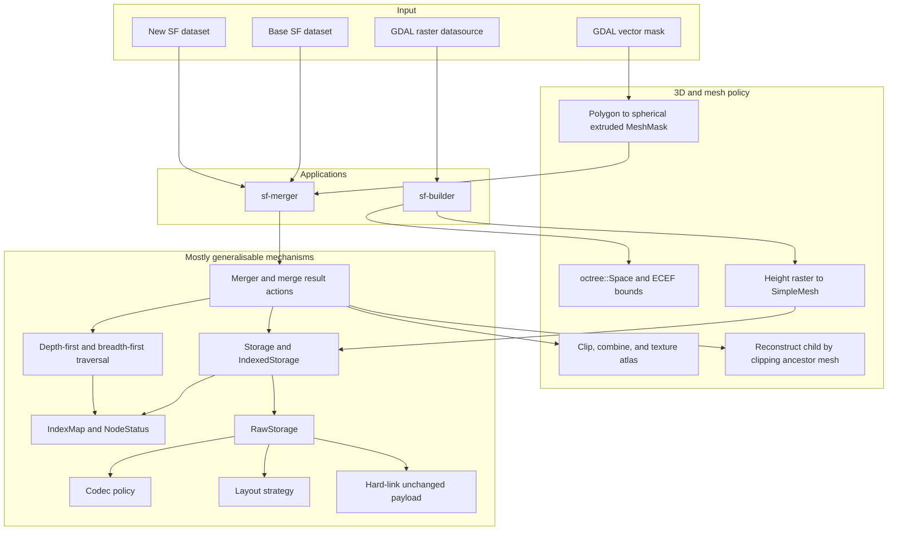
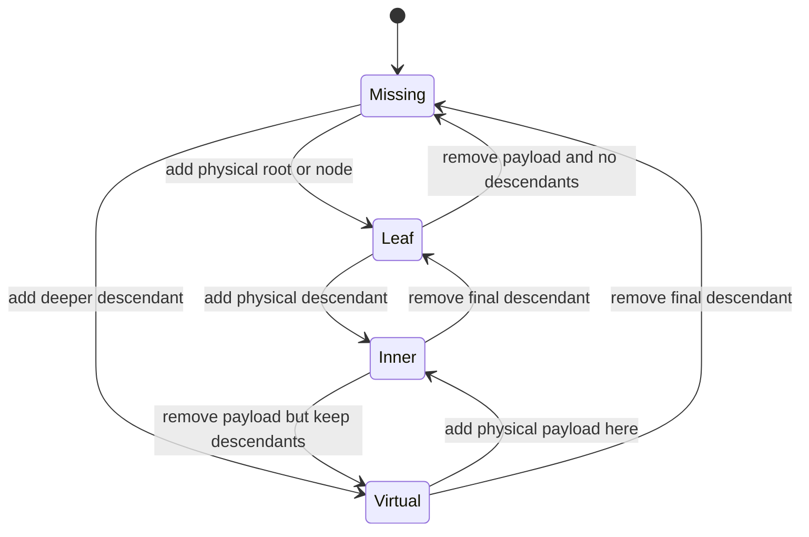
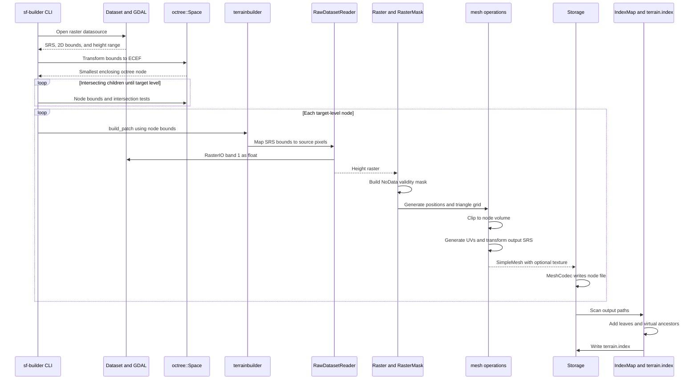
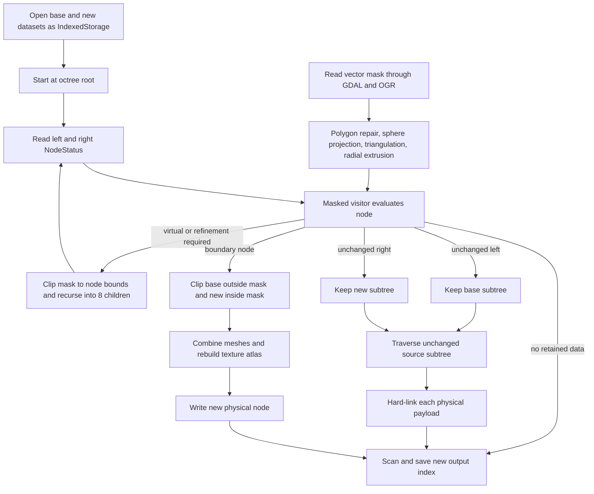
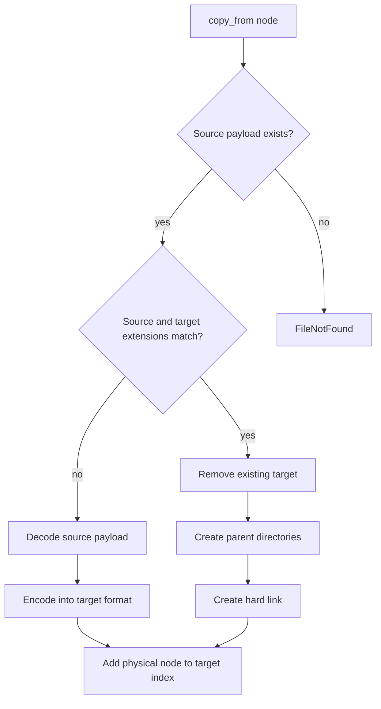
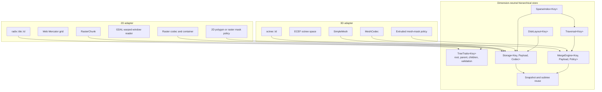

# SF storage and merge architecture before the 2D/3D refactor

This report describes the existing Structura Fundamentalis (SF) builder,
sparse octree index, storage stack, and mask-based dataset merger. Its purpose
is to identify the mechanisms that can be generalised from 3D octrees to a
shared 2D/3D hierarchy without carrying mesh- and ECEF-specific behaviour into
the common storage layer.

The central conclusion is:

> Generalise the sparse hierarchy, storage, traversal, merge decisions, and
> unchanged-subtree reuse. Keep GDAL ingestion, raster processing, mesh
> construction, spatial transforms, and mask geometry in dimension-specific
> adapters.

The current storage templates are already payload-generic, but they are not
hierarchy-generic: `octree::Id` is embedded throughout indexing, traversal,
caches, disk paths, and serialization.

## Current architecture



The significant code boundaries are:

- hierarchy identity: [`octree::Id`](../../../src/terrainlib/octree/Id.h);
- sparse topology: [`IndexMap`](../../../src/terrainlib/octree/IndexMap.h);
- traversal: [`octree::traverse`](../../../src/terrainlib/octree/traverse.h);
- logical storage:
  [`Storage_`](../../../src/terrainlib/octree/storage/Storage.h);
- raw file and hard-link storage:
  [`RawStorage_`](../../../src/terrainlib/octree/storage/RawStorage.h);
- disk paths: [`disk::Layout`](../../../src/terrainlib/octree/disk/Layout.h);
- merge driver: [`Merger`](../../../src/sf_merger/merge.h).

## Sparse index model

The index has four logical states:

| State | Physical payload | Indexed descendants |
|---|---:|---:|
| `Missing` | no | no |
| `Virtual` | no | yes |
| `Leaf` | yes | no |
| `Inner` | yes | yes |

`Missing` is represented by absence from `IndexMap`. The other states are
defined by
[`NodeStatus`](../../../src/terrainlib/octree/NodeStatus.h).



This state machine is dimension-independent. What is currently 3D-specific is
how a node finds its parent and children: `octree::Id` uses three
Morton-interleaved coordinates and eight children.

Traversal is also reusable in concept. It:

1. looks up the root in the sparse index;
2. visits only entries that exist;
3. enumerates children through the concrete ID type; and
4. supports depth-first or breadth-first order plus a refinement predicate.

The only reason
[`traverse()`](../../../src/terrainlib/octree/traverse.h)
is 3D is its dependency on `octree::Id` and `octree::Id::children()`.

## Creating an SF dataset from a GDAL datasource

The current SF builder creates physical mesh nodes at one requested octree
level.



### Current components

| Responsibility | Current component |
|---|---|
| Own and open a GDAL datasource | [`Dataset`](../../../src/terrainlib/Dataset.h) |
| One-time GDAL registration | [`initialize_gdal_once()`](../../../src/terrainlib/init.cpp) |
| ECEF octree geometry | [`octree::Space`](../../../src/terrainlib/octree/Space.h) |
| Batch enumeration and orchestration | [`build_all_patches()`](../../../src/sf_builder/terrainbuilder.cpp) |
| Direct source-window reading | [`RawDatasetReader`](../../../src/sf_builder/raw_dataset_reader.h) |
| Height-to-mesh conversion | [`build_reference_mesh_patch()`](../../../src/sf_builder/mesh_builder.cpp) |
| Optional imagery | [`TileProvider`](../../../src/sf_builder/tile_provider.h) and [`texture_assembler.h`](../../../src/sf_builder/texture_assembler.h) |
| Mesh persistence | `Storage_<SimpleMesh, MeshCodec>` |
| Sparse topology | `IndexMap` |
| Index creation and serialization | `save_or_create_index()` and `terrain.index` |

For a new output, `build_all_patches()` opens unindexed storage. Individual
saves therefore do not build the index incrementally. The final
`save_or_create_index()` recursively scans the output directory, parses node
paths, and calls `IndexMap::add()`.

### More suitable 2D GDAL path

The separate
[`DatasetReader`](../../../src/tile_builder/DatasetReader.h)
is closer to what a 2D SF or raster-store builder needs:

- it accepts requested target-SRS bounds and output dimensions;
- it creates a GDAL warped VRT;
- it reprojects into the target grid; and
- it returns `radix::Raster<float>`.

[`Tiler`](../../../src/tile_builder/Tiler.h) and
[`ParallelTiler`](../../../src/tile_builder/ParallelTiler.h)
already enumerate `radix::tile::Id` values over dataset bounds.

Their grid calculations are useful, but `ParallelTileGenerator` is a
delivery-file writer rather than an SF snapshot builder.

## Mask-based SF dataset merging



### Merge components

- [`Merger`](../../../src/sf_merger/merge.h) is the recursive dispatcher.
- [`NodeLoader`](../../../src/sf_merger/NodeLoader.h) reports status and loads
  payloads.
- When an exact payload is missing, `NodeLoader` searches physical ancestors
  and reconstructs the requested child by clipping the ancestor mesh. That
  reconstruction is 3D-specific.
- [`NodeData`](../../../src/sf_merger/merge/NodeData.h) lazily exposes a node
  payload to a visitor.
- [`Result`](../../../src/sf_merger/merge/Result.h) gives the driver four
  actions: recurse, ignore, preserve one source unchanged, or write a merged
  payload.
- [`Masked`](../../../src/sf_merger/merge/visitor/Masked.h) implements
  mesh-and-mask policy.
- [`NodeWriter`](../../../src/sf_merger/NodeWriter.h) writes changed nodes or
  copies unchanged subtrees.

The vector-mask pipeline in
[`mask.h`](../../../src/sf_merger/mask.h)
is almost entirely 3D and Earth-specific after OGR polygon loading:

```text
OGR polygons
  -> referenced 2D polygon mask
  -> ECEF and spherical projection
  -> triangulated surface
  -> extrusion over an Earth-radius interval
  -> closed 3D MeshMask
```

For 2D raster merging, only the OGR polygon loading and CRS transformation
ideas remain relevant. Triangulation, spherical projection, extrusion, 3D
clipping, and texture atlases should not enter the generic core.

## Hard-link behaviour

Hard links are implemented at the lowest storage layer in
[`RawStorage_::copy_from()`](../../../src/terrainlib/octree/storage/RawStorage.h):



Properties:

- Hard linking is payload-agnostic and fully generalisable.
- It happens only when source and target filename extensions match.
- Different formats cause decode and re-encode through the codec.
- There is no copy fallback if hard-link creation fails, including across
  filesystems.
- Snapshot immutability is not enforced by `Storage_`; it is a caller-level
  convention.
- The existing target file is removed before the link is created.
- The new output receives a fresh index; `terrain.index` itself is not linked.

## Generalisation assessment

| Mechanism | Assessment | Required change |
|---|---|---|
| `NodeStatus` state model | Reuse essentially unchanged | Move outside `octree` naming |
| `IndexMap` state transitions | Generalise | Template over node key and tree traits |
| Sparse traversal | Generalise | Obtain children through tree traits |
| `Storage_<T, Codec>` | Good starting point | Also template over node key and layout |
| `RawStorage_` hard-link behaviour | Generalise | Key-neutral paths and explicit fallback policy |
| Codec concept | Reuse | No dimensional dependency |
| Cache interface | Generalise | Key type is currently `octree::Id` |
| Layout strategy | Generalise | Key-neutral path API |
| Index file | Replace or version | Record topology kind, format version, and validated key |
| Merge result algebra | Generalise | `Merged` must hold generic payload, not `SimpleMesh` |
| Recursive merge driver | Generalise | Tree traits, payload, loader/writer, and policy |
| Unchanged-subtree reuse | Reuse | Enumerate every physical state, including `Inner` |
| GDAL datasource ownership | Reuse or adapt | Typed, multi-band reads and explicit NoData |
| Mask loading through OGR | Reuse or adapt | Produce dimension-specific mask representation |
| `octree::Space` | Keep 3D | Add a sibling 2D grid or space policy |
| Mesh clipping, atlas, and UV code | Keep 3D | Do not place in generic storage |
| ECEF and spherical mask conversion | Keep 3D | 2D uses polygon classification or rasterisation |
| `MeshCodec` | Keep 3D | Add a raster chunk codec or container |

## Existing `Inner` limitation

The index supports `Inner`, but the SF merger effectively does not:

- `Merger::call_merge()` dispatches only `Missing`, `Leaf`, and `Virtual`
  combinations.
- `Masked::visit()` declares `Inner` unreachable.
- `NodeWriter::copy_subtree_to_output()` skips `Virtual` and asserts every
  other visited node is `Leaf`.

This matters because a physical coarse node coexisting with physical
descendants is exactly the `Inner` case. A general 2D/3D implementation should
make "has a physical payload" and "has indexed descendants" independent
properties and handle all four states throughout traversal and merging.

## Recommended target architecture



The central abstractions should therefore be:

1. `TreeTraits<Key>`: root, parent, children, maximum depth, and key
   validation.
2. `SparseIndex<Key>`: the current `IndexMap` algorithm.
3. `Traversal<Key, TreeTraits>`: DFS, BFS, and refinement independent of child
   count.
4. `DiskLayout<Key>`: key-to-path and path-to-key conversion.
5. `Storage<Key, Payload, Codec>`: logical storage and index maintenance.
6. `MergeEngine<Key, Payload, Policy>`: paired sparse-tree walking.
7. Generic merge actions such as `Recurse`, `Ignore`, `KeepLeft`, `KeepRight`,
   and `Write<Payload>`.
8. A snapshot copier that hard-links unchanged physical nodes without knowing
   their payload type.
9. Separate 2D and 3D spatial, mask, and fallback policies.

The GDAL builder and mask merger should be clients of this core, not part of
it.
